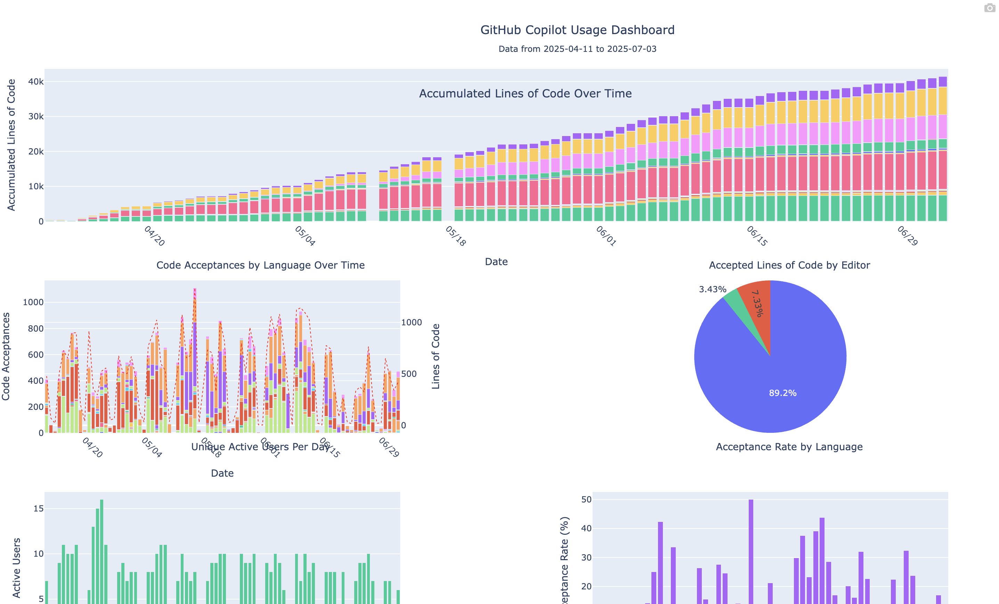

# pilot-metrics

A command-line tool for processing, analyzing, and visualizing GitHub Copilot usage data to help understand your organization's Copilot adoption and usage patterns.

## Features

- **Interactive Visualizations**: Generate HTML dashboards with Plotly showing:
  - Code acceptances by language over time (stacked bar chart)
  - Accepted lines of code by editor (pie chart)
  - Unique active users per day
  - Acceptance rate by language
- **BigQuery Integration**: Upload processed metrics to Google BigQuery
- **Unix-friendly**: Accepts data from files or stdin

## Installation

```bash
# Clone the repository
git clone git@github.com:Fraser-Isbester/gh-copilot-metrics.git
cd gh-copilot-metrics

# Install dependencies
uv sync
```

## Usage

### Visualize Data

Generate an interactive HTML dashboard:

```bash
# From file
uv run pilot-metrics visualize data/copilot_data.json

# From file stdin
cat data/copilot_data.json | uv run pilot-metrics visualize -

# From API response
gh api \
  -H "Accept: application/vnd.github+json" \
  -H "X-GitHub-Api-Version: 2022-11-28" \
  /orgs/ORG/copilot/metrics | uv run pilot-metrics visualize -
```

This creates `dashboard.html` with interactive charts showing your Copilot usage patterns.



### Upload to BigQuery

Upload processed data to Google BigQuery:

```bash
# Set environment variables
export GCP_PROJECT_ID="your-gcp-project-id"
export BQ_DATASET="pilot_metrics_analytics"

# Authenticate with Google Cloud
gcloud auth application-default login

# Upload data
uv run pilot-metrics upload-to-bq data/copilot_data.json

# Or from stdin
cat data/copilot_data.json | uv run pilot-metrics upload-to-bq
```

### Get Help

```bash
uv run pilot-metrics --help
uv run pilot-metrics visualize --help
uv run pilot-metrics upload-to-bq --help
```

## Development

### Code Quality

```bash
# Format code
ruff format .

# Lint code
ruff check .

# Type checking
uv run ty check .
```

## Data Format

The tool expects GitHub Copilot usage data in JSON format with daily statistics including:

- Code completions by editor and language
- Chat interactions (IDE and dotcom)
- Pull request summaries
- User engagement metrics

See `data/copilot_data.json` for an example format.

## Requirements

- Python 3.9+
- UV package manager
- For BigQuery: Google Cloud SDK and appropriate permissions
